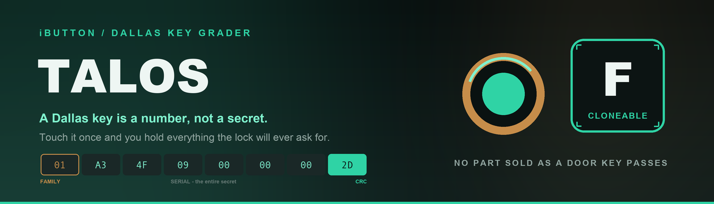
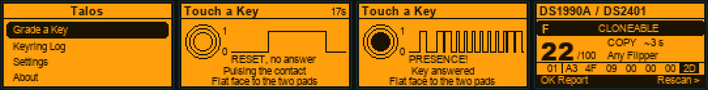
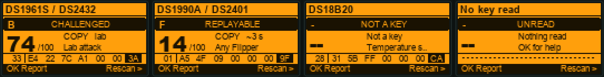
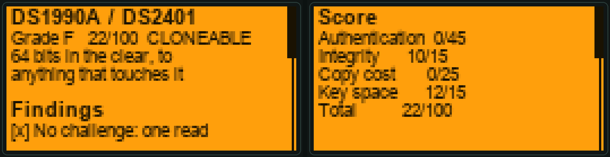
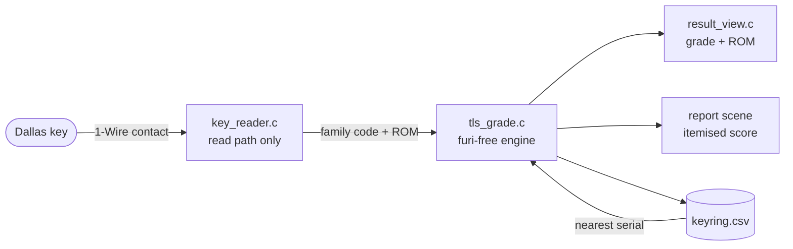

<div align="center">



[](https://github.com/at0m-b0mb/Talos-FlipperZero/actions/workflows/build.yml)
[](LICENSE)
[](https://flipperzero.one/)
[](https://github.com/flipperdevices/flipperzero-firmware)
[](test/host_grade_test.c)

**Touch a Dallas key to the contact. Find out what it actually proves.**

</div>

---

Talos was the bronze guardian of Crete: unkillable, tireless, and held together by
a single vein closed with a single nail. Pull the nail and the giant falls.

A Dallas key is a single number.

Touch one to the two pads at the top-left of a Flipper and it answers `READ ROM`
with 64 bits — a family code, six serial bytes, a checksum — and that is the
entire conversation. No challenge, no nonce, nothing held back. Whoever touches
the key once holds everything the lock will ever ask for.

**Talos** identifies the part from its family code and hands back a plain-English
security grade with a full report: what the key proves, what a copy would cost,
and how much is left to guess.



---

## What it does

- **Grades 41 family codes** — door keys, memory parts, the three SHA-1-capable
  buttons, and the sensors people touch by mistake — plus **Cyfral** and
  **Metakom** intercom fobs.
- **Verifies the ROM's own checksum** on-device, and says so when it fails,
  because a key whose CRC does not match is often a blank that a copier wrote
  carelessly — a key that is already a copy.
- **Compares each serial against your keyring log** and tells you when a site's
  keys were issued in a sequential run. This is the finding no single key can
  show you (see [below](#sequential-serials)).
- **Refuses to grade what is not a credential.** A DS18B20 is a thermometer.
  Scoring it against door criteria would be a lie.
- **Explains every number.** The four terms are itemised on-device so you can
  check the arithmetic. A grade nobody can check is just an opinion.
- **Logs everything to CSV** for a site survey you can open in a spreadsheet.

### Strictly read-only

Talos uses the firmware's read path and nothing else. It never writes a blank,
never emulates your key, and leaves the part exactly as it found it.

The stock iButton app on the same device can do all three. **That is the attack,
and it is why the grade is what it is.**

---

## The thesis: almost everything is an F

That is the finding, not a bug.

Authentication is worth **45 of the 100 points**, and no part sold as a door key
scores any of them. What still varies — and what you compare keys by — is the
score, the band, and what a copy costs.

| Band | Score | Meaning |
|---|---|---|
| `REPLAYABLE` | < 15 | Short enough, or plain enough, that the device reading it can simply *be* it. |
| `CLONEABLE` | 15–34 | One touch copies the whole credential onto a blank that costs about a dollar. |
| `GATED` | 35–64 | Something beyond the open serial is asked for — though not a secret kept back. |
| `CHALLENGED` | ≥ 65 | It answers a challenge by proving a secret it never puts on the wire. |
| `NOT A KEY` | — | A sensor or a switch. Not scored. |
| `UNREAD` | — | Nothing answered the reset pulse. Not scored, and never called safe. |

Letter thresholds are identical to [Warden](https://github.com/at0m-b0mb/Warden-FlipperZero)
(13.56 MHz) and [Bastion](https://github.com/at0m-b0mb/Bastion-FlipperZero)
(125 kHz), so an F on any of the three means the same thing.

### The four terms

```
Authentication  0-45   does it prove a secret it never sends?
Integrity       0-15   would a mangled or forged ROM be caught?
Copy cost       0-25   does a copy need more than a blank?
Key space       0-15   how much is left to guess inside one site?
```

### What that produces

| Part | Family | What it is | Score | Grade | Band |
|---|---|---|---|---|---|
| Cyfral | — | Intercom key, 2 bytes | 0 | **F** | `REPLAYABLE` |
| Metakom | — | Intercom key, 4 bytes | 6 | **F** | `REPLAYABLE` |
| DS1990A / DS2401 | `01` | Serial-number iButton | 22 | **F** | `CLONEABLE` |
| DS1420 | `81` | Serial ID / licence dongle | 22 | **F** | `CLONEABLE` |
| DS1971 / DS2430A | `14` | 256-bit EEPROM | 28 | **F** | `CLONEABLE` |
| DS1972 / DS2431 | `2D` | 1 Kbit EEPROM | 32 | **F** | `CLONEABLE` |
| DS1992 / DS1993 / DS1996 | `08` `06` `0C` | NVRAM parts | 34 | **F** | `CLONEABLE` |
| DS1977 | `37` | 32 Kbit password EEPROM | 48 | **D** | `GATED` |
| DS1991 | `02` | MultiKey secure memory | 50 | **C** | `GATED` |
| DS1961S / DS2432 | `33` | 1 Kbit EEPROM + SHA-1 | 74 | **B** | `CHALLENGED` |
| DS1963S | `18` | SHA-1 monetary iButton | 74 | **B** | `CHALLENGED` |
| DS1957 / DS1955 | `16` | Java iButton coprocessor | 82 | **A** | `CHALLENGED` |
| DS18B20, DS2408, … | `28` `29` … | Sensors and switches | — | **–** | `NOT A KEY` |



### The catch on the good ones

DS1961S and DS1963S carry a real SHA-1 engine: the reader sends a challenge, the
key answers with a MAC computed from a secret that is never transmitted and
cannot be read back.

Talos reads the ROM — which is all any 1-Wire device offers without being asked —
so **it cannot see whether your lock ever issues a challenge.** Plenty of
installations fit crypto-capable buttons and then compare the serial anyway. If
yours does, the key is an F like any other. The report says so on the screen.

---

## Sequential serials

The trick no single key can show you.

Dallas issues serial numbers **in order**, so a site that bought a strip of keys
holds a contiguous run of them. With logging on, Talos compares every key against
the ones already on file — and when two sit a few numbers apart, the 48-bit field
collapses to a handful of guesses:

| Distance to nearest logged key | Key space | Left to guess |
|---|---|---|
| none | 12 / 15 | 48 bits |
| 1 – 4 | 4 / 15 | ~3 bits |
| 5 – 64 | 6 / 15 | ~7 bits |
| 65 – 4096 | 8 / 15 | ~13 bits |
| 4097 – 1048576 | 10 / 15 | ~21 bits |
| further | 12 / 15 | 48 bits |

Grade two keys from the same door and watch the score drop. An exact match is
ignored on purpose — re-reading the same key is not evidence of anything.

---

## The screens

The scan view draws the bus the way a logic analyser would, because the whole
conversation is short enough to fit on the screen. While Talos is sensing, the
worker really is pulling the line low for a reset, releasing it, and finding
nothing there — an empty trough is exactly what an empty contact looks like. When
a key answers, the trace gains the one edge that matters: the **presence pulse**.
Then the ROM clocks out, least significant bit first, a short low for a `1` and a
long low for a `0`, which is how the bus actually encodes them.

The result screen puts the whole ROM on one line, family code and checksum fenced
off, with the CRC cell inverted when it verifies and struck through when it does
not. That graphic *is* the argument: a Dallas key's entire secret fits on a
128-pixel screen with room to spare.



---

## Install

**From the Flipper app catalogue** — search for *Talos* in
[Flipper Lab](https://lab.flipper.net/apps) and install over USB.

**From a release** — download `talos.fap` from
[Releases](https://github.com/at0m-b0mb/Talos-FlipperZero/releases) and copy it to
`/ext/apps/iButton/` on the SD card (via qFlipper, or the SD card directly).

**From source** — see below.

Then: **Apps → iButton → Talos**.

---

## Build from source

```bash
python3 -m pip install --upgrade ufbt
git clone https://github.com/at0m-b0mb/Talos-FlipperZero.git
cd Talos-FlipperZero
ufbt
```

The `.fap` lands in `dist/`. `ufbt launch` builds and runs it on a connected
Flipper. Verified against the release SDK (API 87.1) and the dev channel
(API 88.2).

### Tests

The grading engine is plain C with no Flipper headers — deliberately, so it can
be compiled for the host and checked on every push:

```bash
make -C test
```

3966 checks under ASan and UBSan: every family code's score, letter, band and
clone class; both sides of every boundary; the CRC; the neighbour ladder; string
bounds against the pixel widths they have to fit; and a coverage check that fails
the build if a family code is added to the table without a grade pinned to it.

### Regenerating the art

```bash
python3 tools_gen_icons.py     # the 10x10 app icon
python3 tools_gen_banner.py    # banner + social card
python3 tools_gen_mockups.py   # the 128x64 screen mockups
```

The mockups copy their coordinates from the layout constants in `views/*.c` and
run the same trace timeline the firmware does, so they stay honest when a row
moves — and they caught two real collisions before this shipped.

---

## Layout

```
talos.c / talos_i.h        app shell, notification feedback
application.fam            manifest
helpers/
  tls_grade.c/.h           the brain: family table, four-term score  (furi-free)
  key_reader.c/.h          read-only wrapper around the iButton worker
  tls_store.c/.h           settings, keyring CSV, neighbour search
views/
  scan_view.c              the 1-Wire trace: reset, presence, ROM
  result_view.c            the grade, and the whole ROM on one line
scenes/                    start / scan / result / report / keyring / settings / about
test/                      host tests for the grading engine
```



---

## Ethics

Grade keys you own or are authorised to test. Know your own doors before someone
else does.

Talos tells you what any reader already learns for free. It does not copy
anything, and it will not report a key as safe because it failed to read it.

## License

MIT — see [LICENSE](LICENSE).

<div align="center">

**by [at0m-b0mb](https://github.com/at0m-b0mb)**

Siblings: [Warden](https://github.com/at0m-b0mb/Warden-FlipperZero) grades 13.56 MHz cards ·
[Bastion](https://github.com/at0m-b0mb/Bastion-FlipperZero) grades 125 kHz badges ·
Talos grades the contact.

</div>
